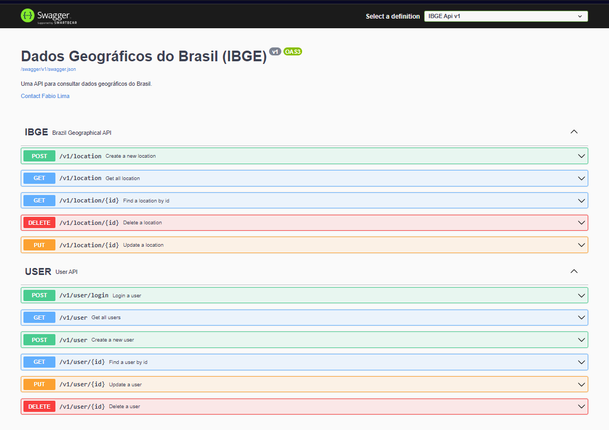

# Sistema de Informações Geográficas

Este projeto consiste em um repositório que contém dados sobre cidades e estados de todo o Brasil.

## Funcionalidades do Projeto

A API oferece o serviço de cadastro de usuários, permitindo que, após o login, os usuários utilizem os seguintes serviços:

- **Cadastro de Localidade:** Permite que o usuário cadastre uma localidade de acordo com o perfil do IBGE.
- **Consulta de Localidades:** Possibilita a consulta de todos os registros de localidades, além de consultas específicas por ID, Cidade e Sigla do Estado.
- **Atualização de Cadastro de Localidade:** Permite a modificação do cadastro de localidade.
- **Remoção de Registro de Localidade:** Permite a exclusão de um registro de localidade.

## Tecnologia 

- **.NET 7**
- **Docker**
- **SQLite**

## Dependências

- **Auto Mapper**
- **Fluent Validation**
- **MediatR**
- **Entity Framework Core**
- **Entity Framework Core - Sqlite**
- **JWT Bearer Authentication**
- **JWT Tokens**
- **Dependency Injection**

## Configuração do Docker Compose

Para facilitar o desenvolvimento e testes, recomendamos a utilização do Docker com um contêiner SQLite. Utilize o seguinte comando para iniciar o contêiner:

```bash
docker-compose up -d
```

Para configurar o Docker Compose, adicione o seguinte código ao seu arquivo `docker-compose.yml`:

```yaml
version: '3'
services:
  sqlite3:
    image: nouchka/sqlite3:latest
    stdin_open: true
    tty: true
    volumes:
      - ./db/:/root/db/
```

## Geração de Migrações

Para realizar a geração de migrações e atualizar o banco de dados, siga os passos abaixo:

## Passo 1: Abra um terminal na raiz do projeto.

## Passo 2: Execute o seguinte comando para criar uma nova migração:

```bash
dotnet ef migrations add NomeDaMigracao

Substitua "NomeDaMigracao" pelo nome desejado para a migração.
```

## Passo 3: Execute o seguinte comando para aplicar a migração ao banco de dados:

```bash
dotnet ef database update
```

## Referências

Para entender melhor as práticas adotadas e as tecnologias utilizadas, recomendo a leitura das seguintes referências:

- [ASP.NET Core CQRS Mediator](https://balta.io/blog/aspnet-core-cqrs-mediator)
- [Tutorial ASP.NET Core - Min Web API](https://learn.microsoft.com/pt-br/aspnet/core/tutorials/min-web-api?view=aspnetcore-8.0&tabs=visual-studio)
- [Rotas com Handlers - ASP.NET Core](https://learn.microsoft.com/pt-br/aspnet/core/fundamentals/minimal-apis/route-handlers?view=aspnetcore-8.0)

## API IBGE

